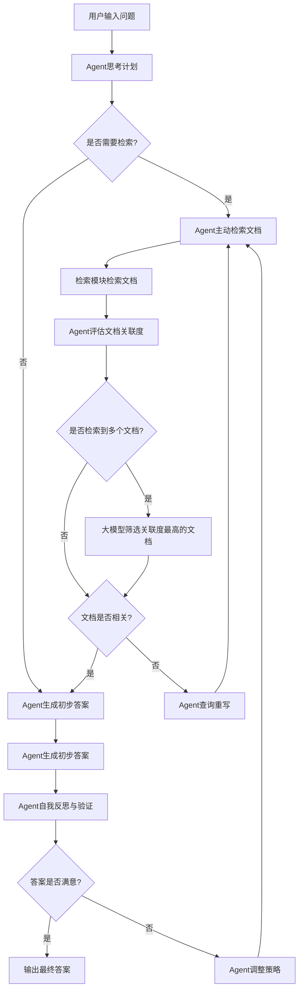

需安装依赖 tsc，bun，node 23(用于 next)

## DEBUG 篇

1. 当前可以 launch.json 配置差不多了，但是如果想 debug 某个具体的 test 任务
   输入以下指令，并运行attach Bun。
   bun test --inspect-wait=localhost:6499/ your-file
   注意：要有断点才能停下来奥🔬

### 图的详细说明：
1. **用户输入问题**：用户向系统提出问题。
2. **Agent思考计划**：Agent接收问题并决定是否需要检索文档。
3. **是否需要检索**：
   - 如果需要，进入 **Agent主动检索文档**。
   - 如果不需要，直接进入 **Agent生成初步答案**。
4. **Agent主动检索文档**：Agent调用检索模块，从知识库中检索相关文档。
5. **检索模块检索文档**：检索模块根据问题检索出多个文档。
6. **Agent评估文档关联度**：Agent评估检索到的文档与问题的相关性。
7. **是否检索到多个文档**：
   - 如果检索到多个文档，进入 **大模型筛选关联度最高的文档**。
   - 如果只检索到一个文档，直接进入 **文档是否相关**。
8. **大模型筛选关联度最高的文档**：大模型从多个文档中筛选出关联度最高的文档。
9. **文档是否相关**：
   - 如果文档相关，进入 **Agent生成初步答案**。
   - 如果文档不相关，进入 **Agent查询重写**，优化问题后重新检索。
10. **Agent查询重写**：Agent优化问题后重新检索。
11. **Agent生成初步答案**：Agent根据相关文档和问题生成初步答案。
12. **Agent自我反思与验证**：Agent对生成的答案进行自我反思和验证。
13. **答案是否满意**：
    - 如果满意，输出最终答案。
    - 如果不满意，Agent调整检索或生成策略，重新检索或生成答案。

这个架构图更详细地描述了在评估文档关联度时，如果检索到多个文档，大模型如何筛选关联度最高的文档，并根据需要重新检索其他文档的逻辑。你可以将上述代码复制到支持 Mermaid 的工具中查看可视化效果。
